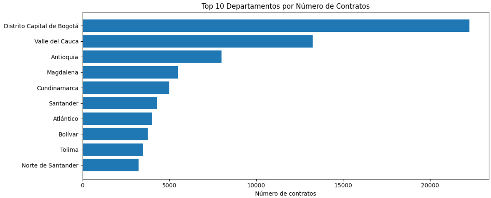
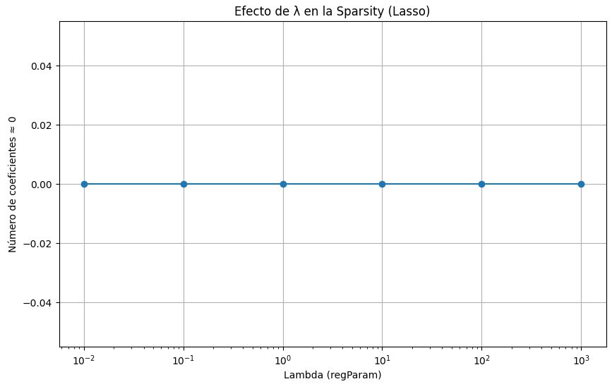
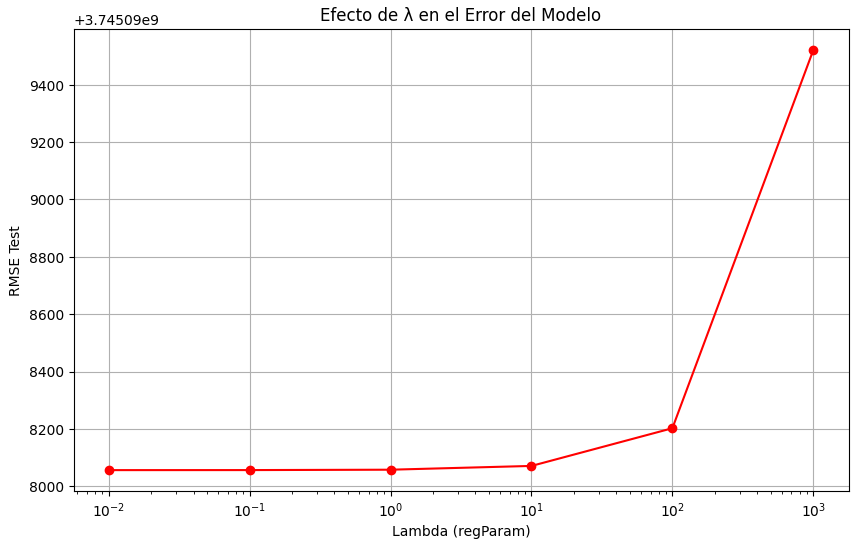
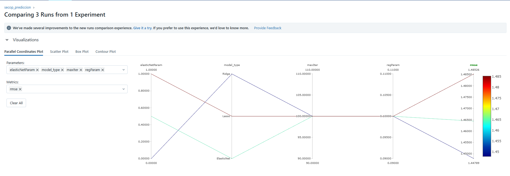
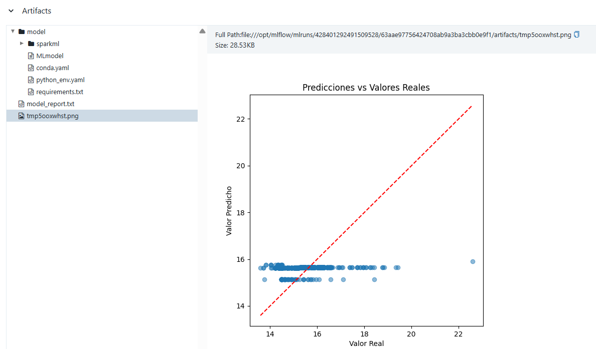
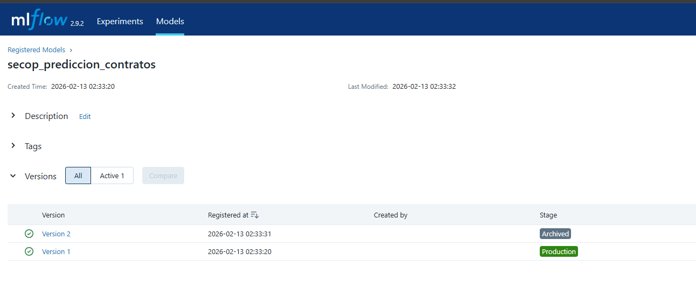
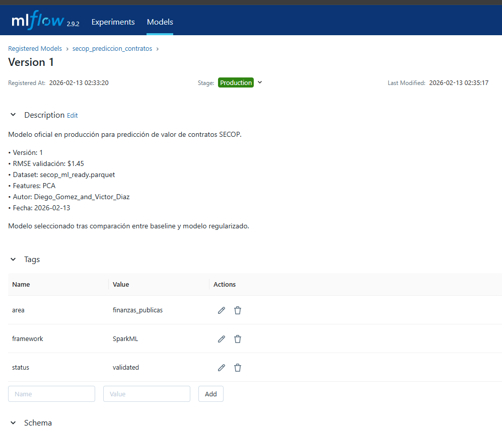

# **Análisis de la Dinámica Contractual del Estado Colombiano usando Datos Abiertos de SECOP II**

**Desarrollado por:** Diego Alejandro Gomez Cortes

### **Introducción**

SECOP II (Sistema Electrónico para la Contratación Pública) es la principal plataforma de transparencia y seguimiento de la contratación estatal en Colombia. A través de esta plataforma se registran los contratos públicos de entidades nacionales y territoriales, permitiendo el acceso abierto a información clave como valores contratados, tipos de contrato, entidades, proveedores y estados contractuales. El volumen, diversidad y naturaleza pública de estos datos convierten a SECOP II en una fuente estratégica para el análisis económico, administrativo y de política pública.

El análisis de los datos de SECOP II permite identificar patrones de contratación, concentración de recursos, comportamientos por territorio y modalidades contractuales, así como posibles riesgos o ineficiencias en el uso de los recursos públicos. Dado que la contratación estatal representa una porción significativa del gasto público, su estudio sistemático aporta valor tanto para la toma de decisiones institucionales como para el control ciudadano y el desarrollo de modelos analíticos y predictivos.

Desde una perspectiva de datos, SECOP II plantea retos propios de los entornos Big Data: grandes volúmenes de información, esquemas complejos, datos heterogéneos y actualizaciones constantes. Por esta razón, el uso de herramientas distribuidas como Apache Spark, Visual Studio Code, Java, JupyterLab y Docker resultan fundamentales para procesar, explorar y preparar estos datos de forma eficiente y escalable.

### **Objetivo del Análisis**

El objetivo de este trabajo es comprender el comportamiento de la contratación pública registrada en SECOP II, explorando sus principales características estructurales y económicas mediante técnicas de análisis de datos a gran escala. A partir de esta exploración, se busca sentar las bases para la construcción de análisis avanzados y modelos de Machine Learning que permitan extraer conocimiento útil sobre la dinámica contractual del Estado colombiano.

## **Cargue de los Datos**

En una primera fase, se tuvo en cuenta la construccion de entornos de trabajos adecuados para el tratamiento de los datos del Secop para asi mismos tratar con diferentes entornos que nos ayudaran asu analisis y gracias a esto se realizó la ingesta de datos directamente desde la API de Datos Abiertos Colombia, seleccionando los contratos más recientes que cuentan con fecha de firma registrada. Posteriormente, la información fue cargada en un entorno distribuido con Apache Spark, donde se exploró su esquema y se normalizaron los nombres de las columnas para garantizar consistencia técnica.

Asi mismo se seleccionaron las variables clave relevantes para el análisis y modelado, y el conjunto de datos resultante fue almacenado en formato Parquet optimizado. Este proceso permitió disponer de una base de datos estructurada, eficiente y lista para análisis exploratorio y etapas posteriores de Machine Learning distribuido.

Query: **01_ingesta_resuelto.ipynb**

## **Análisis Exploratorio de Datos (EDA)**

En esta fase se realizó un análisis exploratorio sobre los contratos electrónicos del SECOP II con el objetivo de comprender la estructura del dataset, la distribución de los valores contractuales y los patrones principales por territorio, tipo y estado del contrato. Este análisis permite validar la calidad de los datos y preparar el terreno para la construcción de variables y modelos de Machine Learning distribuido.

Inicialmente se validó el **periodo temporal efectivo** de los datos analizados a partir de la columna `fecha_de_firma`. Los resultados muestran que los contratos incluidos corresponden principalmente al último trimestre de 2025 y los primeros registros de 2026, confirmando que el dataset representa contratos efectivamente firmados y no simples registros administrativos pendientes.

Posteriormente se calcularon **estadísticas descriptivas generales** y específicas para la variable objetivo `valor_del_contrato`. Se identificó una distribución altamente asimétrica, donde la mayoría de los contratos se concentran en rangos bajos y medios, mientras que una fracción menor representa contratos de muy alto valor. El análisis por rangos permitió cuantificar esta concentración y evidenciar la existencia de contratos de alto impacto presupuestal.

En el análisis territorial se observó una fuerte concentración de contratos en grandes centros administrativos como Bogotá, Antioquia y Valle del Cauca, tanto en número de contratos como en valor total adjudicado. Este comportamiento refleja la centralización de la contratación pública y justifica el uso de análisis regionales más detallados en fases posteriores.

Tambien se exploró la distribución por **tipo de contrato**, donde la modalidad de **Prestación de Servicios** domina ampliamente el volumen de contratos, seguida por modalidades administrativas específicas y contratos de compra y suministro. En cuanto al **estado del contrato**, la mayoría se encuentran en ejecución o han sufrido modificaciones, lo cual es consistente con procesos contractuales activos y dinámicos.

Aparte se aplicó el método **IQR (Interquartile Range)** para la detección de outliers en el valor del contrato, excluyendo previamente valores iguales o menores a cero. El análisis identificó aproximadamente un 15% de contratos como valores atípicos superiores, los cuales no representan errores, sino contratos de gran escala con alto impacto presupuestal. Este resultado confirma la necesidad de aplicar transformaciones y técnicas de escalamiento en las siguientes fases del pipeline de Machine Learning.

El estudio temporal por año y mes evidenció picos claros de contratación hacia finales de 2025, con una disminución marcada al inicio de 2026, lo cual coincide con ciclos fiscales y administrativos propios de la contratación pública en Colombia.

Query: **02_exploracion_eda_resuelto.ipynb**

## Feature Engineering y Construcción de Pipelines

En esta fase se prepararon los datos del **SECOP II** para su uso en modelos de *Machine Learning* utilizando **Spark ML**. A partir del dataset explorado en la fase de EDA, se transformaron variables categóricas y numéricas en un **vector de características numéricas (`features_raw`)**, requisito fundamental para entrenar algoritmos de aprendizaje automático. El proceso se aplicó sobre **100.000 contratos**, garantizando consistencia, escalabilidad y reutilización mediante el uso de **Pipelines**.

### Selección de variables

**Variables categóricas**

Se seleccionaron variables con alto poder explicativo y relevancia contractual:

- `departamento`
- `tipo_de_contrato`
- `estado_contrato`

Estas variables permiten capturar diferencias territoriales, administrativas y operativas entre los contratos registrados en SECOP II.

**Variable numérica**

- `valor_del_contrato_num`

Esta variable representa el valor monetario del contrato y es el principal insumo cuantitativo del modelo.

---

### Limpieza de datos

Se utilizó una estrategia de **eliminación de valores nulos (`dropna`)** únicamente sobre las variables seleccionadas para el modelo. Esta decisión se tomó para evitar sesgos y mantener integridad en el proceso de entrenamiento.

- Registros antes de limpieza: **100.000**
- Registros después de limpieza: **100.000**

No se perdió información, lo que evidencia una **alta calidad del dataset** y permite avanzar sin necesidad de imputaciones artificiales.

---

### Codificación de variables categóricas

Las variables categóricas fueron transformadas usando:

1. **StringIndexer**: conversión de texto a índices numéricos
2. **OneHotEncoder**: transformación de índices a vectores binarios

**Categorías detectadas**

| Variable            | Categorías únicas |
|---------------------|------------------|
| departamento         | 34               |
| tipo_de_contrato     | 20               |
| estado_contrato      | 7                |

**Resultado del OneHotEncoding**

- Total de features categóricas generadas: **61**
- Features numéricas originales: **1**

**Total de features esperadas:** **62**

### Construcción del vector de features

Las variables numéricas y las categóricas codificadas fueron combinadas mediante **VectorAssembler**, generando un único vector:

- `features_raw`

**Validación del resultado**

- Dimensión esperada del vector: **62**
- Dimensión real del vector `features_raw`: **62**

Esto confirma que el proceso de codificación y ensamblaje se ejecutó correctamente.

---

### Construcción del Pipeline

El pipeline se construyó respetando el orden lógico de las transformaciones:

1. StringIndexer  
2. OneHotEncoder  
3. VectorAssembler  

**Resultado del pipeline**

- Total de stages: **7**
  - 3 StringIndexer
  - 3 OneHotEncoder
  - 1 VectorAssembler

El pipeline fue entrenado y aplicado exitosamente sobre el dataset limpio, garantizando reproducibilidad y consistencia en futuras ejecuciones.

### Análisis de varianza de features

Se realizó un análisis de varianza sobre el vector `features_raw` para identificar las dimensiones con mayor capacidad de diferenciación.

**Top 5 features con mayor varianza**

| Feature | Varianza |
|--------|----------|
| Feature 0  | 8.337e+18 |
| Feature 35 | 0.1948 |
| Feature 1  | 0.1699 |
| Feature 55 | 0.1618 |
| Feature 2  | 0.1275 |

**Interpretación:**

- **Feature 0** corresponde al valor del contrato, lo que explica su alta varianza debido a la escala monetaria.
- Las demás features representan categorías específicas con fuerte impacto en la diferenciación de contratos.
- Este comportamiento justifica la necesidad de aplicar **normalización y reducción de dimensionalidad (PCA)** en la siguiente fase.

## Transformaciones Avanzadas 

En esta fase se aplicaron transformaciones avanzadas sobre el dataset previamente procesado mediante Feature Engineering, con el objetivo de **mejorar la calidad de las variables de entrada**, **reducir problemas derivados de escalas heterogéneas** y **disminuir la dimensionalidad del espacio de features** antes de entrenar modelos de Machine Learning.

El punto de partida fue el dataset `secop_features.parquet`, el cual contiene un vector de características (`features_raw`) de 62 dimensiones, compuesto por variables numéricas y categóricas codificadas.

---

**¿Por qué normalizar?**

Al inspeccionar los primeros registros del vector `features_raw`, se evidenció una **alta disparidad en las escalas de las variables**. Por ejemplo, el primer valor del vector corresponde al valor del contrato y presenta magnitudes del orden de millones, mientras que las variables categóricas codificadas toman valores binarios (0 o 1).

Ejemplo de valores observados en `features_raw`: [4.5588e+06, 0.0, 0.0, 0.0, 0.0, 1.0, 0.0, 0.0, 0.0, 0.0]

Esta diferencia de escalas representa un problema para algoritmos de Machine Learning, ya que las variables con valores grandes dominan el proceso de aprendizaje, afectando negativamente la convergencia y la interpretación del modelo.

**Comparación antes y después de StandardScaler**

Para solucionar el problema de escalas, se aplicó `StandardScaler` sobre el vector `features_raw`, generando un nuevo vector normalizado denominado `features_scaled`.

**Estadísticas comparativas:**

**Antes (features_raw):**
- Min: 0.00  
- Max: 75,952,011,382.00  
- Media: 4,756,215.14  
- Desviación estándar: 368,580,743.71  

**Después (features_scaled):**
- Min: 0.00  
- Max: 69.01  
- Media: 0.18  
- Desviación estándar: 1.12  

Estos resultados confirman que el escalado fue exitoso, logrando que todas las variables queden en una escala comparable, condición fundamental para aplicar técnicas como PCA y modelos basados en distancia.

**Configuración de PCA y selección del número de componentes**

Una vez normalizadas las variables, se aplicó **Análisis de Componentes Principales (PCA)** con el objetivo de reducir la dimensionalidad del vector de features.

- Dimensión original del vector: **62**
- Número de componentes seleccionados (k): **30**

El valor de *k* fue ajustado progresivamente para analizar la varianza explicada y encontrar un balance entre reducción dimensional y conservación de información.

Ejemplo del vector transformado (`features_pca`): DenseVector([0.4892, -1.1825, 1.2005, 1.7628, 0.3237, -0.0634, ...])

**Análisis de varianza explicada**

El análisis de varianza explicó cómo cada componente principal contribuye a la información total del dataset.

Resultados acumulados con **k = 30** componentes:

- Componente 10: 22.27% de varianza acumulada
- Componente 20: 39.22% de varianza acumulada
- Componente 30: **55.67% de varianza acumulada**

Este comportamiento evidencia que la varianza está distribuida de forma relativamente homogénea entre las componentes, lo cual es consistente con datasets que incluyen una alta proporción de variables categóricas codificadas.

Aunque no se alcanza el 80% de varianza explicada, el uso de 30 componentes permite una **reducción del 51.6% de la dimensionalidad**, manteniendo una cantidad significativa de información relevante.

**Pipeline completo de transformaciones**

Finalmente, se integraron todas las transformaciones en un **Pipeline completo**, garantizando reproducibilidad, trazabilidad y correcta aplicación del flujo de datos.

Orden de las transformaciones:
1. StandardScaler  
2. PCA  

Este orden es crítico, ya que PCA requiere que las variables estén previamente normalizadas para evitar sesgos en la identificación de componentes principales.

Como resultado, se generó un dataset final listo para modelado (`secop_ml_ready.parquet`), compuesto por:
- `features_pca`: vector reducido de características
- `label`: valor del contrato (`valor_del_contrato_num`)

Adicionalmente, el pipeline entrenado fue persistido para su reutilización en fases posteriores del proyecto, asegurando consistencia entre entrenamiento e inferencia.

## **Modelos de Regresión** 

## **Regresión Lineal**

Se construyo un modelo de **Regresión Lineal en Spark ML** con el objetivo de predecir el **valor del contrato** a partir de las *features* construidas en las fases anteriores (Feature Engineering + PCA). El dataset utilizado corresponde al archivo `secop_ml_ready.parquet`, el cual contiene las variables transformadas y listas para modelado.

**Estrategia de Train/Test Split**

Se definió una estrategia de partición **70% entrenamiento / 30% prueba**, utilizando una semilla fija para garantizar reproducibilidad.

**Resultados del split:**
- Train: **70,122 registros (70%)**
- Test: **29,878 registros (30%)**

Esta proporción es adecuada para datasets grandes (100,000 registros), permitiendo un entrenamiento robusto sin sacrificar capacidad de evaluación.

**Configuración del Modelo de Regresión Lineal**

Se configuró un modelo base de `LinearRegression` sin regularización, con los siguientes parámetros:

- `featuresCol`: `features`
- `labelCol`: `label`
- `maxIter`: 100
- `regParam`: 0.0
- `elasticNetParam`: 0.0

Este modelo sirve como **baseline**, permitiendo evaluar el comportamiento inicial antes de aplicar regularización en fases posteriores.

**Interpretación del R² del Modelo (Train)**

El modelo fue entrenado sobre el conjunto de entrenamiento, obteniendo:

**Métricas en Train:**
- **R² (train): 0.5648**
- **RMSE (train): $3,074,544,375**
 
El valor de R² indica que el modelo explica aproximadamente **56.5% de la variabilidad** del valor de los contratos en el conjunto de entrenamiento. Dado el alto nivel de heterogeneidad y presencia de outliers en los valores contractuales, este resultado es razonable para un modelo lineal base.

**Análisis de Calidad de Predicciones y Errores**

Se analizaron las predicciones sobre el conjunto de prueba, calculando:

- Error absoluto
- Error porcentual
- Identificación de las peores predicciones

**Hallazgos clave:**

1. Se observaron errores absolutos elevados en contratos de valores muy altos.
2. Los errores porcentuales superan el 100% en contratos pequeños, lo cual evidencia:
  - Alta dispersión en los valores
  - Dificultad del modelo lineal para capturar extremos
3. No se detectaron errores sistemáticos por duplicación o fallas de cálculo.

Estos resultados son coherentes con la naturaleza altamente asimétrica del valor de los contratos.

**Comparación Train vs Test (Overfitting)**

Se evaluó el modelo sobre el conjunto de prueba:

**Métricas en Test:**
- RMSE: **$3,048,622,156**
- MAE: **$587,881,077**
- R² (test): **0.5742**

**Comparación Train vs Test:**
- R² Train: **0.5648**
- R² Test: **0.5742**
- Diferencia absoluta: **0.0095**
 
No se evidencia **overfitting**, ya que el desempeño en test es incluso ligeramente superior al de train.  
El modelo generaliza correctamente dentro de las limitaciones propias de la regresión lineal.

**Análisis de Coeficientes del Modelo**

- Intercepto: **$289,073,028**
- Número de coeficientes: **30** (correspondientes a los componentes PCA)

El intercepto representa el valor base estimado cuando todas las *features* son cero. Los coeficientes reflejan la contribución relativa de cada componente principal (PCA), no de variables originales, por lo que su interpretación es **indirecta**.

**Análisis de Distribución de Residuos**

Se calculó el residuo como:

\[
residuo = label - prediction
\]

Se generó un histograma para evaluar su distribución.

**Resultado visual:**

**Interpretación:**
- Los residuos están centrados alrededor de cero.
- Existe alta concentración cerca del origen, con colas largas, lo cual es consistente con:
  - Presencia de outliers
  - Variabilidad extrema en los valores contractuales
- No se observa sesgo sistemático severo.

**Feature Importance Aproximado (Componentes PCA)**

Se analizaron los coeficientes del modelo para identificar los componentes PCA más influyentes (por valor absoluto):

**Top 10 componentes más importantes:**
1. PC8      
2. PC9  
3. PC7  
4. PC3  
5. PC10  
6. PC1  
7. PC6  
8. PC4  
9. PC26  
10. PC16  

Estos componentes concentran mayor información relevante para la predicción. Al tratarse de PCA, no se interpretan directamente como variables originales, sino como combinaciones lineales de ellas, y el resultado confirma que solo una fracción de los componentes tiene impacto significativo.

## **Regresión Logística para Clasificación de Riesgo Contractual**

En esta fase se construyó un modelo de regresión logística con el objetivo de clasificar los contratos del SECOP II según su nivel de riesgo, a partir de las variables transformadas en las etapas previas del pipeline. A diferencia de la regresión lineal, este modelo aborda un problema de clasificación binaria, donde el interés principal es estimar la probabilidad de que un contrato sea considerado de alto riesgo.

El dataset utilizado corresponde a `secop_features.parquet`, el cual contiene 100.000 contratos con variables categóricas codificadas y variables numéricas listas para modelado.

Query: **06_regresion_logistica.py**

**Creación de la variable objetivo binaria**

Dado que el dataset original no cuenta con una variable explícita de riesgo, fue necesario construir una variable objetivo binaria denominada `riesgo`. Para ello se definió un criterio combinado que contempla tanto el riesgo financiero como el riesgo operativo por el tiempo.

Se establecieron las siguientes reglas:

- Riesgo financiero: contratos cuyo valor supera el percentil 90 del valor del contrato.
- Riesgo operativo: contratos con duración definida menor a 30 días.

La regla financiera se aplicó a todos los contratos, mientras que la regla operativa solo se utilizó cuando la duración del contrato estaba disponible. Los contratos con duración no definida fueron clasificados únicamente con base en el criterio financiero, evitando su exclusión del análisis.

Como resultado, se obtuvo la siguiente distribución:

- Contratos de alto riesgo (1): **30.717**
- Contratos de bajo riesgo (0): **69.283**
- Total de registros: **100.000**

Este procedimiento permitió construir una variable objetivo consistente, sin pérdida de información y alineada con criterios reales de riesgo contractual.

**Análisis del balance de clases**

Se analizó la distribución de la variable `riesgo` para evaluar el balance de clases. Los resultados muestran que aproximadamente el 30% de los contratos corresponden a la clase positiva (alto riesgo) y el 70% a la clase negativa (bajo riesgo).

Aunque el dataset no está perfectamente balanceado, el desbalance no es extremo, lo que permite entrenar un modelo base sin necesidad inmediata de técnicas de remuestreo. No obstante, este escenario justifica el uso de métricas adicionales a la accuracy y el posterior ajuste del threshold de clasificación.

**Diferencia entre regresión logística y regresión lineal**

La regresión logística se diferencia de la regresión lineal en que no predice valores continuos, sino probabilidades asociadas a una clase. Utiliza una función sigmoide para transformar la combinación lineal de las variables de entrada en un valor entre 0 y 1, el cual se interpreta como la probabilidad de pertenecer a la clase positiva.

En este proyecto, la regresión lineal se utilizó para predecir el valor del contrato, mientras que la regresión logística se empleó para clasificar contratos según su nivel de riesgo, evidenciando la aplicabilidad de cada modelo según la naturaleza del problema.

**Configuración del modelo**

El modelo de regresión logística se configuró con los siguientes parámetros:

- `maxIter = 100`
- `regParam = 0.0`
- `threshold = 0.5`

Esta configuración corresponde a un modelo base sin regularización, utilizado como punto de referencia antes de introducir penalizaciones y ajustes más avanzados. El threshold de 0.5 se utilizó inicialmente como valor estándar, siendo posteriormente analizado y ajustado en los retos bonus.

**Interpretación de probabilidades**

La columna `probability` generada por el modelo representa la probabilidad estimada de pertenecer a cada clase, donde el segundo valor corresponde a la probabilidad de alto riesgo. Por ejemplo, un valor `probability = [0.8, 0.2]` indica una probabilidad del 20% de que el contrato sea de alto riesgo, por lo que, con un threshold de 0.5, sería clasificado como bajo riesgo.

El análisis de las predicciones evidenció la existencia de casos cercanos al threshold, los cuales representan situaciones de mayor incertidumbre y refuerzan la importancia de evaluar métricas adicionales y ajustar el criterio de decisión.

**Evaluación del modelo con múltiples métricas**

Para evaluar el desempeño del modelo se utilizaron métricas apropiadas para clasificación binaria:

- **AUC-ROC:** **0.8137**
- **Accuracy:** **0.8183**
- **Precision:** **0.8222**
- **Recall:** **0.8183**
- **F1-Score:** **0.8031**

El valor de AUC-ROC indica una buena capacidad del modelo para discriminar entre contratos de alto y bajo riesgo, independientemente del threshold utilizado. Las métricas de precision y recall muestran un desempeño balanceado, lo que sugiere que el modelo logra identificar contratos riesgosos sin generar un número excesivo de falsas alarmas.

**Matriz de confusión**

Se construyó la matriz de confusión sobre el conjunto de prueba, obteniendo los siguientes resultados:

- True Positives (TP): **4.696**
- True Negatives (TN): **19.713**
- False Positives (FP): **867**
- False Negatives (FN): **4.554**

El análisis muestra que el error más crítico corresponde a los falsos negativos, ya que implican contratos de alto riesgo clasificados como bajo riesgo. En el contexto de la contratación pública, este tipo de error es más costoso que un falso positivo, lo cual justifica priorizar métricas como el recall y el ajuste del threshold.

**Ajuste del threshold de clasificación**

Se evaluó el desempeño del modelo utilizando diferentes valores de threshold. Al aumentar el threshold a 0.7, se obtuvo:

- Accuracy: **0.806**
- Recall: **0.806**

Este resultado confirma el trade-off entre precisión y sensibilidad. Un threshold más alto hace al modelo más conservador, reduciendo la detección de contratos riesgosos. Dado el objetivo del análisis, se concluye que no es conveniente utilizar un threshold elevado y que valores cercanos o inferiores a 0.5 son más adecuados para priorizar la detección de riesgo.

**Curva ROC**

Se construyó la curva ROC para visualizar el trade-off entre la tasa de verdaderos positivos (TPR) y la tasa de falsos positivos (FPR) a lo largo de distintos thresholds. La curva se encuentra claramente por encima de la línea de clasificación aleatoria, confirmando la capacidad discriminatoria del modelo.

El valor de AUC cercano a 0.81 respalda los resultados obtenidos en la evaluación cuantitativa y valida el uso de la regresión logística como modelo base para la clasificación de riesgo contractual.

## **Regularización L1, L2 y ElasticNet**

En esta fase se evaluó el impacto de la regularización sobre el modelo de regresión lineal construido previamente con componentes principales (PCA). El objetivo fue analizar si la penalización L1, L2 o ElasticNet permitía reducir el overfitting observado y mejorar la capacidad de generalización del modelo.

Dataset utilizado: `secop_ml_ready.parquet`  
Split aplicado: 70% entrenamiento – 30% prueba  
Semilla: 42  

**Comprender la Regularización**

Escenario conceptual:

- R² train = 0.95  
- R² test = 0.45  

Este escenario indica **overfitting**. El modelo aprende demasiado bien los datos de entrenamiento pero no generaliza correctamente a datos nuevos.

La regularización introduce una penalización sobre los coeficientes del modelo, reduciendo su magnitud y limitando la complejidad. Esto ayuda a evitar que el modelo memorice ruido.

**Configuración del Evaluador**

Se configuró un evaluador basado en RMSE:

- Penaliza fuertemente errores grandes.
- Mantiene interpretabilidad en unidades monetarias.
- Es consistente con el análisis previo realizado en regresión lineal.

Métrica utilizada: `rmse`  

**Experimento con Múltiples Regularizaciones**

Se entrenaron 18 modelos variando:

**regParam (λ):**

- 0.0  
- 1.0  
- 10.0  
- 100.0  
- 1000.0  
- 10000.0  

**elasticNetParam (α):**

- 0.0 → Ridge  
- 0.5 → ElasticNet  
- 1.0 → Lasso  

Total modelos entrenados: 18  

**Resultados del Experimento**

**Modelo sin regularización:**

- RMSE Train: $2,797,195,710.17  
- RMSE Test:  $3,745,098,056.02  

**Ridge (λ = 1):**

- RMSE Test: $3,745,098,056.37  

**ElasticNet (λ = 1):**

- RMSE Test: $3,745,098,056.93  

**Lasso (λ = 1):**

- RMSE Test: $3,745,098,057.49  

A medida que λ aumenta, el RMSE Test aumenta ligeramente, indicando pérdida progresiva de capacidad predictiva (underfitting). El menor RMSE se obtuvo con λ = 0.0. La regularización no mejoró el desempeño del modelo en este caso.

**Comparación de Overfitting**

Brecha aproximada:

Gap = RMSE_Test − RMSE_Train
Gap ≈ 947,902,345.85

La brecha se mantiene prácticamente constante en todas las configuraciones.

Interpretación:

- No se observa reducción significativa del overfitting mediante regularización.
- El modelo basado en PCA ya presenta estabilidad estructural.
- Incrementar λ solo aumenta el error sin reducir la brecha train-test.

**Modelo Final**

Se seleccionó como mejor modelo:

- regParam = 0.0  
- elasticNetParam = 0.0  

Resultados finales:

- RMSE Train: $2,797,195,710.17  
- RMSE Test:  $3,745,098,056.02  

Modelo guardado en: /opt/spark-data/raw/regularized_model

**Efecto de λ en Lasso**

Se evaluó cómo cambia el número de coeficientes en cero al aumentar λ en Lasso (L1).

Resultados:

- λ = 0.01 → 0/30 coeficientes en 0  
- λ = 0.10 → 0/30 coeficientes en 0  
- λ = 1.00 → 0/30 coeficientes en 0  
- λ = 10.00 → 0/30 coeficientes en 0  
- λ = 100.00 → 0/30 coeficientes en 0  
- λ = 1000.00 → 0/30 coeficientes en 0  

No se eliminó ningún coeficiente. Esto ocurre porque el modelo trabaja sobre componentes PCA, que son combinaciones lineales densas y ortogonales. Lasso tiende a generar sparsity cuando existen features originales altamente redundantes o poco relevantes, lo cual no sucede en este espacio reducido de 30 componentes principales.

#### Visualización del efecto de λ

Efecto de λ en la sparsity (Lasso):

Efecto de λ en el error del modelo:

Las gráficas muestran que:

- El número de coeficientes en cero permanece constante.
- El RMSE aumenta progresivamente al incrementar λ.
- Valores altos de λ inducen underfitting.

La regularización no mejoró el desempeño del modelo en este dataset. Dado el uso previo de PCA en el cual se estabiliza el modelo reduciendo colinealidad. Asi mismo Lasso no generó sparsity debido a la naturaleza de los componentes principales. Por lo cual, valores altos de λ aumentarian el error de predicción y en este caso específico, el modelo sin regularización resultó óptimo.

## **Optimizacion de Hiperparametros**

### **Validacion Cruzada**

La **Validación Cruzada (K-Fold Cross-Validation)** con el objetivo de obtener una estimación más robusta del desempeño del modelo de regresión. A diferencia del simple train/test split, la validación cruzada divide el conjunto de entrenamiento en *K subconjuntos*, entrenando el modelo múltiples veces y rotando el conjunto de validación en cada iteración. Esto permite reducir la varianza de la métrica y minimizar el riesgo de seleccionar un modelo que funcione bien solo por una partición favorable de los datos.

Se construyó un **ParamGrid** que incluyó múltiples combinaciones de hiperparámetros (`regParam`, `elasticNetParam`, `maxIter`, `fitIntercept`), generando un total de **36 combinaciones**. Con un valor de **K=5 folds**, el sistema entrenó **180 modelos en total**, evaluando cada uno mediante la métrica **RMSE**. El mejor modelo encontrado presentó los hiperparámetros `regParam = 1.0` y `elasticNetParam = 0.5` (ElasticNet), con un **RMSE promedio en Cross-Validation de 3,333,757,188.27**.

Posteriormente, el mejor modelo fue evaluado sobre el conjunto de prueba independiente, obteniendo un **RMSE en test de $2,342,402,953.62**, lo cual confirma un buen nivel de generalización. Se realizó además una comparación entre el modelo obtenido mediante Cross-Validation y uno entrenado únicamente con simple split, observándose resultados idénticos en este caso específico, debido a la estabilidad del dataset y a la consistencia de los hiperparámetros seleccionados.

Por otro lado se realizo un experimento adicional variando el número de folds (K=3, K=5 y K=10), observando que un mayor número de folds reduce ligeramente el RMSE promedio pero incrementa considerablemente el tiempo computacional (23.5s, 36.1s y 71.1s respectivamente). Esto evidencia el trade-off clásico entre robustez estadística y costo computacional. El modelo óptimo fue guardado para su uso en fases posteriores de optimización avanzada y despliegue.

## **Optimizacion de Hiperparametros**

Se implementaron estrategias de optimización de hiperparámetros sobre el modelo de Regresión Lineal con regularización, utilizando los datos transformados del archivo `secop_ml_ready.parquet`. Se diseñó un grid de búsqueda en escala logarítmica para `regParam` (0.01, 0.1, 1.0), distintos valores de `elasticNetParam` (0.0, 0.5, 1.0) y variaciones en `maxIter`. Este enfoque permitió evaluar combinaciones de Ridge (L2), Lasso (L1) y ElasticNet dentro de un marco estructurado y reproducible.

Se ejecutó Grid Search combinado con Cross-Validation (K=3), obteniendo como mejor configuración: `regParam = 1.0`, `elasticNetParam = 1.0` y `maxIter = 50`, con un RMSE en test de **$2,342,402,953.27**. El tiempo de ejecución fue de 18.63 segundos. En paralelo, se implementó Train-Validation Split con `trainRatio = 0.8`, logrando exactamente los mismos hiperparámetros óptimos y el mismo RMSE en test, con un tiempo de ejecución menor (6.66 segundos). Esto evidencia que, para este dataset, ambas estrategias convergieron al mismo mínimo.

Se realizó un refinamiento adicional del grid alrededor de la mejor zona encontrada, probando valores cercanos como `regParam = 0.9` y `elasticNetParam = 0.9`. El nuevo modelo obtuvo un RMSE de **$2,342,402,953.42**, prácticamente igual al anterior, lo que confirma que la región óptima es estable y que no existen mejoras significativas en esa vecindad del espacio de búsqueda.

El modelo óptimo fue guardado en `/opt/spark-data/raw/tuned_model`, junto con los hiperparámetros seleccionados en un archivo JSON para garantizar trazabilidad. Los resultados muestran que el uso de regularización adecuada y validación estructurada permite obtener un modelo robusto, con mejor capacidad de generalización frente a los experimentos iniciales sin ajuste sistemático de hiperparámetros.

# **MLOps y Produccion**

## **MLflow Tracking**

En este reto se configuró la conexión con el servidor de MLflow utilizando la URI `http://mlflow:5000`, lo que permitió centralizar el registro de experimentos en un servidor dedicado y no en archivos locales. Se creó el experimento `secop_prediccion`, donde se almacenan todos los runs relacionados con el modelo de predicción de contratos. Esto garantiza trazabilidad, organización y comparabilidad entre diferentes entrenamientos del modelo.

**Registro del Modelo Baseline**

Se entrenó un modelo base de regresión lineal sin regularización (`regParam=0.0`, `elasticNetParam=0.0`) utilizando como variable objetivo el **logaritmo del valor del contrato**, con el fin de estabilizar la varianza y reducir el impacto de valores extremos.

Las métricas obtenidas fueron:

- **RMSE:** 1.45  
- **MAE:** 0.99  
- **R²:** 0.3545  

Estas métricas están calculadas en **escala logarítmica**, lo que implica que los errores representan diferencias relativas y no absolutas en pesos colombianos. El modelo fue almacenado como artefacto dentro del run, permitiendo su posterior consulta o descarga desde la interfaz de MLflow.

**Registro de Múltiples Modelos (Ridge, Lasso y ElasticNet)**

Se entrenaron tres modelos adicionales con diferentes tipos de regularización: Ridge (L2), Lasso (L1) y ElasticNet (L1 + L2), todos con `regParam=0.1`. Cada run registró parámetros, métricas (RMSE, MAE y R²) y el modelo entrenado como artefacto.

🔹 **Ridge**
- **RMSE:** 1.45  
- **MAE:** 1.00  
- **R²:** 0.3530  

🔹**Lasso**
- **RMSE:** 1.49  
- **MAE:** 1.04  
- **R²:** 0.3192  

 🔹 **ElasticNet**
- **RMSE:** 1.46  
- **MAE:** 1.02  
- **R²:** 0.3381  

Se observó que el modelo Ridge obtuvo el mejor desempeño general en términos de RMSE y R², aunque las diferencias entre modelos fueron moderadas.

**Exploración y Comparación en MLflow UI**

Se utilizó la interfaz web de MLflow para comparar los runs lado a lado, ordenar por RMSE y analizar las diferencias en parámetros y métricas. Se observó que el modelo Ridge presentó el menor RMSE (≈ 1.45), consolidándose como la mejor alternativa dentro de los experimentos evaluados.

## **Registro de Artefactos Personalizados**

Se creó un nuevo run donde, además de registrar el modelo y métricas, se agregó un reporte en texto con los resultados y un gráfico de **predicciones vs valores reales en escala logarítmica**. Este gráfico permitió visualizar el comportamiento del modelo respecto a la línea de predicción perfecta y evidenciar la tendencia del modelo a concentrarse alrededor de la media.

Estos archivos fueron almacenados como artefactos dentro de MLflow, permitiendo su visualización directa desde la interfaz.

## **Model Registry**

El ciclo completo de gestión de modelos utilizando el **Model Registry de MLflow**, con el objetivo de versionar, promover y consumir modelos de forma controlada. Se logro, configurando la conexión al servidor de MLflow y se definió el nombre del modelo como `secop_prediccion_contratos` y se estableció el entorno para registrar versiones oficiales del modelo de predicción del valor de contratos SECOP.

En el primer paso se entrenó y registró la versión 1 (baseline) sin regularización, almacenando métricas y registrándola directamente en el Registry. Luego se entrenó la versión 2 con regularización (ElasticNet), comparando su RMSE frente al baseline. Tras la evaluación, se determinó que la versión 1 presentó un mejor desempeño, por lo que fue promovida a **Production**, mientras que la versión 2 fue archivada. Este proceso permitió aplicar correctamente el ciclo de vida: `None → Staging → Production → Archived`.  
 

Posteriormente se agregó metadata y descripción formal al modelo en producción, incluyendo versión, RMSE validado, dataset utilizado, tipo de features (PCA), autor y fecha. Esto garantiza trazabilidad, documentación técnica y gobernanza del modelo dentro del Registry.  
 

Finalmente, se cargó el modelo directamente desde el Registry utilizando la URI lógica: "models:/secop_prediccion_contratos/Production", se verificó su correcto funcionamiento realizando predicciones sobre el conjunto de prueba. El RMSE obtenido coincidió exactamente con el registrado durante el entrenamiento, confirmando reproducibilidad, control de versiones y correcta gestión del ciclo de vida del modelo.

